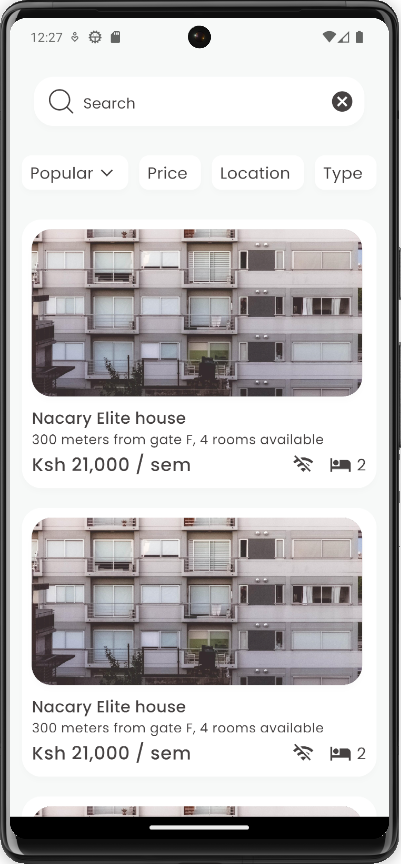
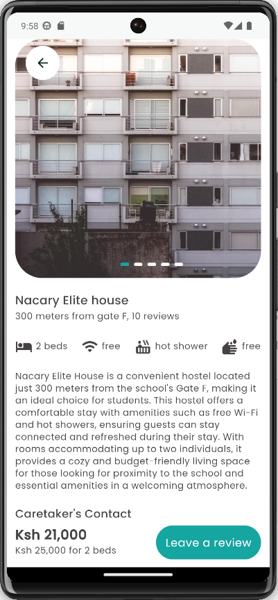

# ATC (All Things Chuka) - Android App

## Problem Statement

As students at CU, we often find it challenging to access essential information and services related to campus life. This includes finding suitable hostels, staying updated on events, checking commodity prices, and keeping up with the latest school news. To address this, we're developing the ATC (All Things Chuka) app, a one-stop solution for students to enhance their university experience.

## Features

### Hostel Finder

- **Description**: Finding suitable accommodation around campus can be a hassle. The Hostel Finder feature allows users to discover and explore different hostels, making it easier to find a place to stay during the academic year.
- **Functionality**:
  - View a list of different hostels around the school.
  - Access detailed information about each hostel, including pricing, amenities, and contact details.
  - Rate hostels based on your experience.
  - Read reviews from other students about their hostel stays.
- **Purpose**: To help students make informed decisions about their accommodation and improve their overall living experience during their time at university.

### Upcoming Features

#### Events
- **Description**: Staying informed about upcoming events on campus and around campus is crucial for students. The Events feature will provide a centralized platform for accessing event details and schedules.
- **Functionality**:
  - View a calendar of upcoming events, including academic, cultural, and sports events.
  - Access event descriptions, locations, and timings.
  - Receive event notifications and reminders.
- **Purpose**: To keep students engaged and informed about the various activities happening in and around the university.

#### Marketplace
- **Description**: Checking commodity prices and exploring dining options on and around campus can be time-consuming. The Marketplace feature will simplify this process by providing price and menu information for eateries, vendors, and the school's mess hall.
- **Functionality**:
  - View menus, prices, and special offers from different vendors.
  - Compare prices for essential commodities.
  - Check the daily menu at the school's mess hall.
- **Purpose**: To make it convenient for students to plan their meals and purchases while considering their budget.

<!-- #### News
 **Description**: Staying updated with the latest news and announcements from the university is essential. The News feature will allow students to access news articles, radio broadcasts, and other important announcements.
- **Functionality**:
  - Read news articles and updates.
  - Listen to radio broadcasts from the school's radio station.
  - Receive notifications for urgent announcements.
- **Purpose**: To provide students with a reliable source of information and keep them connected with the university community.
-->
## Let's Make Campus Life Easier!

We believe that together, we can create a fantastic resource that simplifies campus life for all students at CU. Join us in building the ATC (All Things Chuka) app and make a lasting impact on our university community.

---

